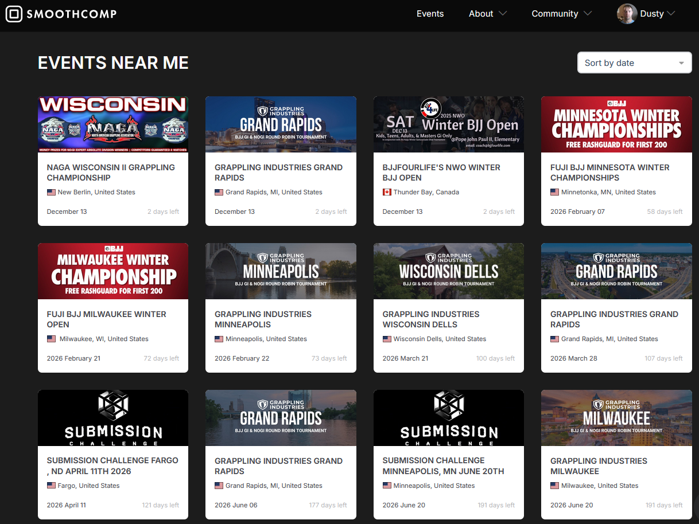
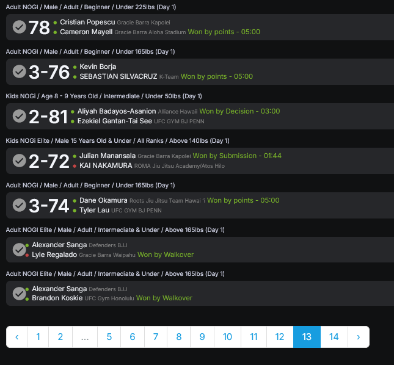

Readme.md
# Smoothcomp AWS Data Engineering Project
## Purpose
This project details the process of building an automated ETL pipeline to analyze jiu-jitsu event and match data from https://www.smoothcomp.com/ to populate Power BI dashboards.  

The dashboard attempts to answer questions such as 
* How many athletes compete in Jiu-Jitsu?
* How does the popularity compare between styles, age groups, and skill levels?
* How many competitions do athletes participate in? 
* Does additional competitions improve performance?

### Languages Used
- Python
- SQL
- M
- DAX

### Technologies Used
- Docker
- AWS Fargate
- AWS S3 
- AWS Athena + Glue
- Power BI
-  Github Actions

## Project Overview
The construction and automated deployment of the ETL data pipeline will
be broken down into the following steps:

#### Extract
- Scraping **event** and **match** web pages from Smoothcomp using Python
- Persisting raw HTML files to **Amazon S3** for reproducible processing

#### Transform
- Parsing and normalizing raw HTML into structured datasets
- Writing transformed data to columnar **Parquet** files in **Amazon S3**

#### Load
- Defining external tables in **AWS Glue**
- Querying transformed datasets using **Amazon Athena**
- Connecting **Power BI** to **Athena** for analytics and visualization
- Developing an interactive analytics dashboard

#### CI / CD
- **Dockerizing** the web scraper for consistent execution
- Deploying the scraper to **AWS Fargate** for scheduled automation
- Using **GitHub Actions** to build and publish container images

## Project Details
### **E**xtract

To honor the https://www.smoothcomp.com/robots.txt file, only one page is scraped every 10 seconds.
Events are scraped by month with up to two pages, but 
matches for each event can have dozens and occasionally 100+ pages of matches. 
With approximately 5,000 events and approximately 2 million matches, 
scraping the HTML pages took about 8 days.
Extracting a new month takes close to 8 hours per month.

#### Events Web pages
The past events search page allows filtering results using the inputs 
on the page or using URL query parameters.
Results for each downloaded page will be limited to 

* Only in the USA
* Only jiu-jitsu style events
* Only 1 month at a time for organizational purposes

An example URL for the month of November 2025 is https://smoothcomp.com/en/events/past?countries=US&cg=1,3,4,7&startDate=2025-11-01&endDate=2025-11-30&page=1
Months may contain more than 40 events, so multiple pages may be saved.
Each extracted page will be saved with the format ***{YYYYMM}_{Page_Number}.html***.

    

#### Matchlist Web Pages

Each event has a matchlist with 32 matches displayed per page. A page of matches looks like:

    

Each match includes competitor information, the outcome of the match,
and one text field that lists the age, skill level, gender, weight class, and style.
Each of those attributes will need to be parsed in the *transform* step.

### **T**ransform
#### Creating Event Records
Parsing each event into a record was straightforward. Each event record includes 
* event_id
* title
* href / event URL
* location
* date
* federation

The event URL will include the federation it belongs to if it has a federation.
The location is saved as-is, but isn't always accurate enough to plot on a map.
The date is usually accurate, but the year is omitted if the event occurs in the current year.

#### Creating Match Records
Each match will contain two records, one record per competitor,
and will be added to the matches_fact table. Each record includes
* event_id
* match_id - randomly generated string
* bout_number - unfornately not used because it is not 
always filled out properly and sometimes blank
* athlete_id
* club
* win - either a 1 or 0
* submission_win - either a 1 or 0
* loss - either a 1 or 0
* submission loss - either a 1 or 0
* style - either Gi or No-Gi
* age - either youth, adult, or masters
* gender
* skill - either belt color in Gi or 
beginner, intermediate, or advanced in No-Gi
* weight_class

The matches_fact table is the primary table used in this analysis. 
To consolidate all the individual pages of matches for each event,
all match files are merged by year into individual parquet files and saved to an AWS S3 bucket.

#### Dimension Tables
Most of the dimension tables join to the match_fact table.
In the matches table, style, skill, and age, each field is a numeric key 
and is defined in dimension tables.
For example, the *intermediate* skill level will show an 11 in the matches table, 
and a corresponding record with an 11 and the name "Intermediate" 
will in the skill_dimension table.

The purpose of the dimension tables is to minimize repeating text labels and
add categorical attributes to certain dimensions.  For example,
the *Beginner* skill level in No-Gi is equivalent to the 
*White* belt division in Gi, so these can be grouped together.

The dimension tables are:
* athlete_dim
* age_bracket_dim
* gender_dim
* skill_dim
* federation_dim

### **L**oad
The matches_fact, events_dim, and dimension tables are all saved in separate AWS S3 buckets
to allow AWS Glue to define tables as a concatenation of every parquet file in that folder.

Views are created in AWS Glue and Athena which are loaded into Power BI.

